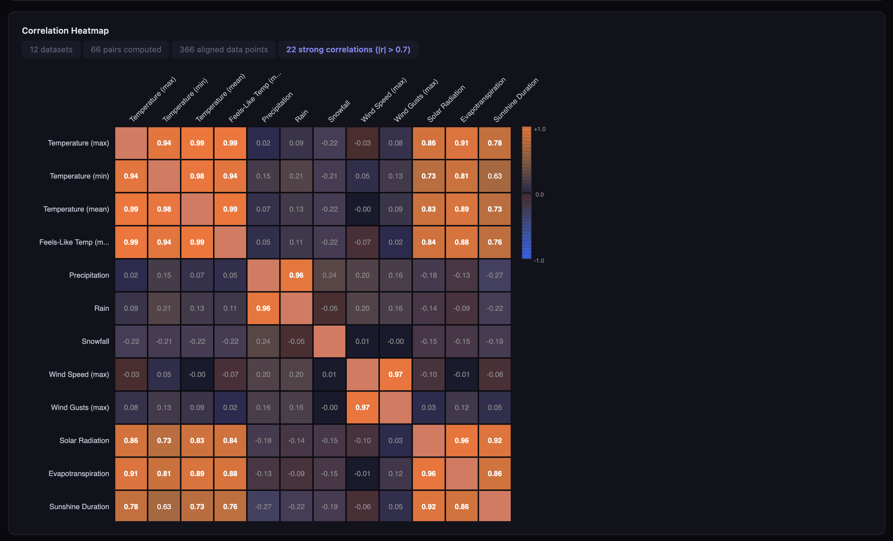
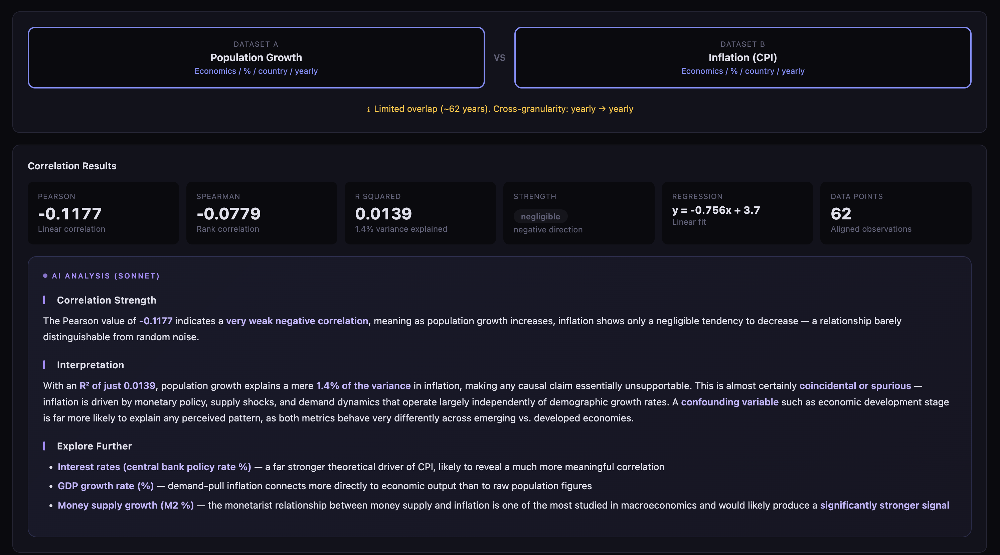
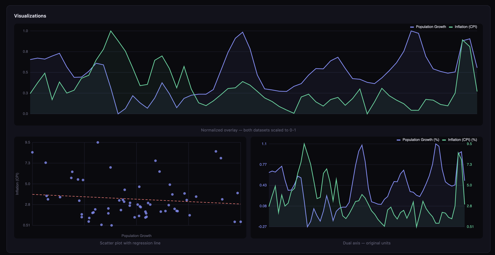

# Correlo

**Find hidden connections in the world's data.**

Correlo connects to **146 free public APIs** and lets you explore individual datasets or correlate any two of them — from weather and stock markets to CO2 levels and birth rates. A Rust/WASM engine computes statistics in the browser, and an AI layer explains what the numbers actually mean.

> **Status: Early Alpha** — This is an experimental project. The scope is not yet fully defined. APIs may break, data quality varies, and the UI is evolving. Contributions and feedback welcome.



## By the Numbers

| | |
|---|---|
| **146** | Datasets from free public APIs |
| **10,585** | Possible correlation pairs (146 choose 2) |
| **28** | Categories (weather, finance, health, climate, ...) |
| **15** | City locations (Vienna, NYC, Tokyo, ...) |
| **20+** | Countries for country-level data |
| **3** | Modes: Explore single dataset, Compare two, or Matrix view |

## What it does

### Explore a Single Dataset

Select any dataset and click **Explore** to see its full time series — chart, stats (mean, median, std dev, range, IQR), and a data table with all values.

### Compare Two Datasets



Pick any two of 146 datasets. Correlo fetches the data, aligns time series across different granularities (daily, monthly, yearly), and computes:

- **Pearson correlation** — linear relationship strength
- **Spearman correlation** — monotonic relationship (rank-based)
- **R-squared** — how much variance is explained
- **Linear regression** — slope, intercept, trend line
- **P-value approximation** — statistical significance

An optional AI analysis (Claude Sonnet) explains the correlation in plain language — whether it's likely causal, coincidental, or driven by a hidden variable.



### Correlation Matrix

Select multiple datasets and generate an NxN correlation matrix to spot patterns across many variables at once.

### AI-Powered Search

Ask a question in natural language (e.g., "Does weather correlate with Covid deaths?") and the AI suggests relevant datasets and comparison pairs from the catalog.

## 146 Datasets, 28 Categories

| Category | Examples |
|----------|----------|
| Weather | Temperature, rain, snow, humidity, wind, UV index, sunshine |
| Climate | CO2, methane, N2O, sea level, Arctic ice, global warming |
| Air Quality | EU/US AQI, PM2.5, PM10, ozone, NO2, SO2, CO |
| Finance | Gold, silver, Bitcoin, Ethereum, EUR/USD, 8 more exchange rates |
| Economics | GDP, inflation, unemployment, trade balance, debt, CPI |
| Demographics | Population, fertility, life expectancy, mortality, urbanization |
| Energy | Oil, gas prices, UK carbon intensity, renewable energy share |
| Health | WHO life expectancy, neonatal mortality, immunization, physicians |
| Astronomy | Sunspot activity, near-Earth asteroids |
| Ocean | Sea surface temperature, wave height, salinity |
| Open Source | npm downloads (react, vue, svelte...), PyPI stats (pandas, numpy...) |
| Development | GINI index, R&D expenditure, education spending, internet users |
| Biodiversity | iNaturalist observations (birds, insects, plants, mammals) |
| Wikipedia | Page views for Bitcoin, AI, climate change, COVID-19, and more |
| EU/UK | Unemployment, inflation, industrial production, GDP, tourist nights |

### Smart Data Alignment

Datasets come in different granularities and time ranges. Correlo handles this automatically:

- **Cross-granularity**: Daily data paired with yearly data? Correlo aggregates to the coarser level using means.
- **Smart fetching**: Each API is fetched with optimal parameters — yearly APIs get 20+ years of history, daily APIs expand when paired with long-range data.
- **Compatibility filtering**: Incompatible datasets are greyed out in the UI before you even try.

## Architecture

```
Browser (vanilla JS, no framework)
  |
  |--- Rust/WASM engine (Pearson, Spearman, regression, stats, matrix)
  |--- Charts (Canvas 2D — time series, scatter, dual-axis, overlays)
  |
Python server (aiohttp)
  |
  |--- 38 async fetch handlers for 146 APIs
  |--- AI layer (Claude API — insight, search, data parsing)
  |--- Smart caching with content-hash dedup
  |
146 Free Public APIs
  |--- No API keys needed for data (World Bank, NOAA, ECB, WHO, ...)
  |--- AI features require an Anthropic API key
```

## Quick Start

### Prerequisites

- Python 3.10+
- Rust + `wasm-pack` (for building the correlation engine)

### 1. Clone and install

```bash
git clone https://github.com/Clemens865/Correlo.git
cd Correlo

# Python dependencies
python -m venv .venv
source .venv/bin/activate
pip install -r requirements.txt
```

### 2. Build the WASM engine

```bash
cd correlation-engine
wasm-pack build --target web --out-dir ../www/pkg
cd ..
```

### 3. Configure API keys (optional)

The data APIs are all free and keyless. The AI features require an Anthropic API key.

Create a `.env` file in the project root:

```bash
# Required only for AI analysis features (search, insight, data parsing)
ANTHROPIC_API_KEY=sk-ant-...

# Optional: change the server port (default: 8080)
PORT=8080
```

**Without an API key**: Everything works except AI features. You still get all 146 datasets, correlation stats, charts, the matrix view, and single-dataset exploration.

**Getting an Anthropic API key**: Sign up at [console.anthropic.com](https://console.anthropic.com), create an API key, and paste it into `.env`. The AI features use Claude Sonnet and Haiku, costing fractions of a cent per query.

### 4. Run

```bash
python server.py
```

Open [http://localhost:8080](http://localhost:8080).

## Data Sources

All 146 datasets come from free, public APIs that require no authentication:

| Provider | Datasets | Granularity |
|----------|----------|-------------|
| Open-Meteo | Weather, marine, air quality, climate | Daily |
| World Bank | GDP, population, CO2, trade, health | Yearly |
| ECB / FRED | Interest rates, exchange rates, money supply | Daily — Monthly |
| NOAA | Global temperature anomalies, sunspots | Monthly |
| CoinGecko | Bitcoin, Ethereum, Dogecoin, Solana + more | Daily |
| WHO GHO | Life expectancy, mortality, immunization, physicians | Yearly |
| Eurostat | EU unemployment, inflation, industrial production | Monthly |
| ONS / UK Gov | UK GDP, CPI, unemployment, carbon intensity | Quarterly / Daily |
| UN SDG | Development indicators, R&D, renewable energy | Yearly |
| NASA POWER | Solar irradiance, temperature, precipitation (since 1981) | Daily |
| USGS | Earthquake magnitude and count | Daily |
| iNaturalist | Biodiversity observations by taxon | Daily |
| Wikipedia | Page view statistics for selected articles | Daily |
| PyPI / npm | Package download statistics | Daily |

## Project Structure

```
Correlo/
  server.py            # aiohttp web server + AI endpoints
  catalog.py           # API catalog (146 entries, 28 categories)
  fetchers.py          # 38 async data fetch handlers
  requirements.txt     # Python dependencies
  wiggum.py            # Exhaustive pair validation script
  correlation-engine/  # Rust WASM library
    src/lib.rs         # Pearson, Spearman, regression, matrix, moving avg
    Cargo.toml
  www/                 # Frontend (vanilla JS, no framework)
    index.html         # Single-page app
    js/app.js          # Main application logic
    js/api.js          # API client layer
    js/charts.js       # Canvas-based chart rendering
    pkg/               # WASM build output (generated)
```

## Known Limitations

- Some API pairs have no time overlap (e.g., 7-day NASA NEO feed vs 20-year World Bank data)
- Free API tiers have rate limits — CoinGecko (1 year max), BLS (25 req/day)
- Correlation does not imply causation. The AI tries to be honest about this.
- This is alpha software. Expect rough edges.

## License

MIT
